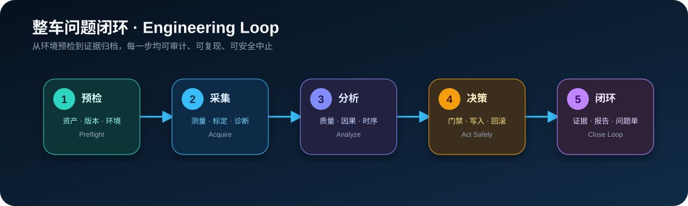
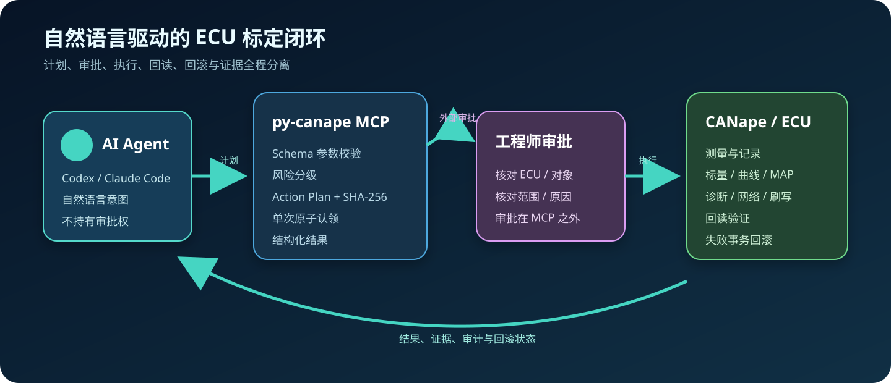
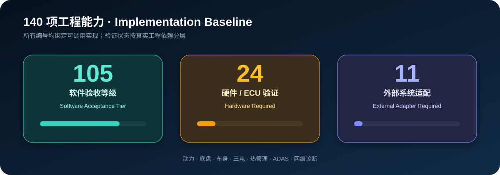
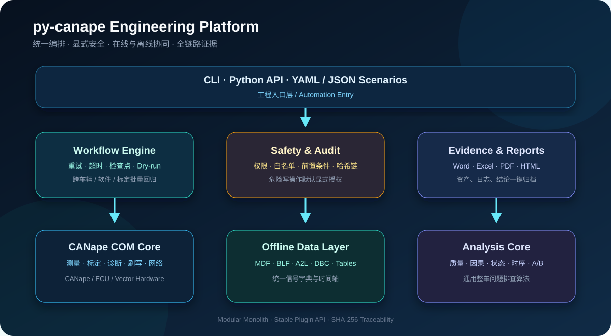

<div align="center">


# Agent2Canape

### 面向整车工程的 CANape 自动化、数据分析与安全编排平台

[](https://www.python.org/)
[](#canape-17-兼容性)
[](./CAPABILITIES.md)
[](#质量与验证)
[](./LICENSE)

**ECU 标定 · AI Agent · 在线测量 · 离线分析 · 安全门禁 · 工程闭环**

[快速开始](#快速开始) · [ECU-标定](#ecu-标定是第一主线) ·
[AI 联动](#codex--claude-code-自然语言驱动) · [能力地图](#140-项工程能力) ·
[架构设计](#平台架构) · [安全边界](#安全边界) ·
[完整能力表](./CAPABILITIES.md)

</div>

---

## 为什么需要 Agent2Canape

真实整车问题排查并不止于“读一个信号”或“写一个标定量”。工程师通常需要同时处理
CANape 项目、ECU 在线状态、MDF/BLF 数据、A2L/DBC 数据库、标定版本、诊断请求、
安全前置条件、分析结论和问题单证据。

`Agent2Canape` 首先是一套面向真实 ECU 的标定工具包，同时将问题排查、测量、诊断、
刷写和数据分析统一到一个可编排、可审计、可扩展的 Python 平台中：

| 工程痛点 | Agent2Canape 提供的能力 |
|---|---|
| 工具与数据分散 | CANape COM、MDF、BLF、A2L、DBC 使用统一 Python API |
| 操作过程难复现 | YAML/JSON 场景、资产哈希、检查点和运行审计 |
| 写操作风险高 | 分级权限、对象/地址白名单、数值范围和车辆状态门禁 |
| 排查依赖个人经验 | 信号质量、状态、因果、时序、控制性能和 A/B 分析 |
| 证据整理耗时 | 自动生成 Word、Excel、PDF、HTML 和完整证据包 |
| 专业扩展成本高 | 动力、底盘、车身、三电、热管理、ADAS 领域插件 |
| AI 只能给建议 | 本地 MCP、结构化 Schema、外部审批和自然语言工程计划 |



## ECU 标定是第一主线

`Agent2Canape` 不把标定简化成单个 `SetValue`。它覆盖从标定对象识别到版本基线、实验和
安全提交的完整工程链：

| 标定阶段 | 已实现能力 |
|---|---|
| 对象建模 | 标量、枚举、ASCII、曲线、轴、二维 MAP、单位、范围、地址、转换规则 |
| 在线读写 | 值和轴联合读写、维度校验、边界拦截、回读验证、失败回滚 |
| 数据集 | JSON/CSV/CDFX/DCM/PAR 导入导出、SHA-256、差异、补丁、三方合并 |
| A2L 语义 | 项目/模块、对象、地址、转换方法、记录布局、轴、单位和字节序 |
| 版本管理 | 车辆/ECU/软件/A2L/HEX 身份绑定、并发提交、完整性巡检和基线冻结 |
| 变更控制 | 变更计划、范围/梯度/单调/联动约束、审批、预览、事务提交 |
| 作业治理 | 功能组/页面/责任人变更集、职责分离、多人评审和结构化摘要 |
| 存储状态 | Working/Reference/RAM/ROM 快照、差异、持久化门禁和审计历史 |
| 标定实验 | 全因子、OFAT、Latin Hypercube、自动采集目标、每轮恢复基线 |
| 实验恢复 | DOE 原子检查点、失败重试、中断恢复、指标和证据 SHA-256 |
| 多 ECU | 全量基线预读、协同提交、任一失败时跨控制器逆序回滚 |
| 优化 | 多指标加权、坐标搜索、Pareto 安全筛选和平衡候选 |
| AI 驱动 | 自然语言规划、MCP 工具、参数摘要绑定、单次外部审批 |

```python
from agent2canape import CalibrationChange, CalibrationDataset, CalibrationPlan

plan = CalibrationPlan(
    name="torque-response-v3",
    changes=[
        CalibrationChange(
            name="TorqueLimit",
            value=320.0,
            expected_before=280.0,
            enforce_expected=True,
            reason="台架满负荷响应优化",
        )
    ],
)
baseline = CalibrationDataset(
    parameters={
        "TorqueLimit": canape.read_calibration_parameter("VCU", "TorqueLimit")
    }
)
print(plan.preview(baseline))
plan.approve("calibration-engineer")
result = plan.apply(canape, "VCU")
```

曲线和 MAP 使用 `read_calibration_parameter` / `write_calibration_parameter`，轴和值作为
一个事务处理。

CDFX/DCM/PAR、A2L 语义目录、身份校验和并发版本基线详见
[生产级标定数据指南](./docs/CALIBRATION_DATA.md)。
生产作业、DOE 恢复和多 ECU 协同见
[生产标定作业指南](./docs/CALIBRATION_OPERATIONS.md)。

## Codex / Claude Code 自然语言驱动



安装 AI 能力后启动本地 MCP Server：

```powershell
.\.venv\Scripts\python.exe -m pip install -e ".[ai]"
.\.venv\Scripts\agent2canape-mcp.exe
```

AI 先把“读取 VCU 的扭矩限制”“修改 TorqueCurve”“启动测量”等自然语言转换为带
JSON Schema 的工程工具。只读动作可直接执行；任何非只读动作都先生成 Action Plan，
必须由工程师在 MCP 之外批准。工具与完整参数的摘要绑定，参数修改、并发重复执行和
计划复用均会被拒绝。

Codex、Claude Code 配置、审批协议和示例见
[AI Agent 联动指南](./docs/AI_INTEGRATION.md)。

## 140 项工程能力

能力清单不是路线图占位，而是由机器可校验的注册表绑定到真实 Python 调用入口。



- **105 项软件验收等级**：实现入口可解析，其中关键链路具备纯软件、模拟 COM 或真实文件测试；
- **24 项硬件验证项**：实现已完成，需要真实 ECU、VN 硬件或台架环境；
- **11 项外部适配项**：实现了稳定接口，需要接入企业身份、问题单或安全系统。

```powershell
agent2canape capabilities
```

期望结果：

```json
{
  "passed": true,
  "count": 140,
  "missing_implementations": [],
  "missing_capabilities": []
}
```

详细编号、能力名称、实现入口和验证等级见
[CAPABILITIES.md](./CAPABILITIES.md)。

注册表验证证明能力编号、契约和调用入口完整，不代表 140 项均已在真实 ECU 上完成独立
行为验收。模块级结论、已修复问题和后续增强清单见
[最终工程审查](./docs/ENGINEERING_AUDIT.md)。

## 平台架构



| 模块 | 主要职责 |
|---|---|
| `CANape` | 会话、设备、测量、标定、记录器、网络、诊断和刷写 |
| `Calibration*` | 数据交换、身份、约束、评审、存储层、DOE 恢复、多 ECU 和 Pareto |
| `CANapeAIToolkit` | AI 工具 Schema、自然语言计划、审批摘要和安全调度 |
| `MCP Server` | Codex、Claude Code 等 Agent 的本地 stdio 接口 |
| `AssetManager` | 环境预检、工程资产、版本清单、SHA-256、快照和恢复 |
| `OfflineData` | CSV、JSON、Parquet、Excel、MDF、BLF、A2L、DBC |
| `SignalDictionary` | 跨数据源统一名称、单位、类型、范围和转换规则 |
| `SignalAnalyzer` | 质量、状态、因果、滞环、时序、控制指标、能量和 A/B |
| `WorkflowEngine` | YAML/JSON、变量覆盖、重试、超时、检查点和 Dry-run |
| `SafetyPolicy` | 权限、白名单、数值边界、车辆前置条件和凭据外置 |
| `Reporter` | 审计链、证据包、Word、Excel、PDF 和 HTML |
| `PluginRegistry` | 领域能力发现、版本约束和第三方适配 |

更完整的设计、失效模式和 ADR：

- [平台架构说明](./docs/ARCHITECTURE.md)
- [ADR-0001：模块化单体](./docs/adr/0001-modular-monolith.md)
- [ADR-0002：可选格式适配器](./docs/adr/0002-optional-format-adapters.md)
- [ADR-0003：显式写安全](./docs/adr/0003-explicit-write-safety.md)

## 快速开始

### 环境要求

- Python 3.10 或更高版本；
- Windows + Vector CANape，用于在线 COM 能力；
- Linux/macOS 可使用离线数据、分析、工作流和报告能力；
- 推荐使用项目虚拟环境，避免影响系统 Python。

### 安装

进入已获取的 Agent2Canape 源码目录：

```powershell
cd Agent2Canape

python -m venv .venv
.\.venv\Scripts\python.exe -m pip install --upgrade pip
.\.venv\Scripts\python.exe -m pip install -e ".[all]"
```

只安装基础 CANape 控制能力：

```powershell
.\.venv\Scripts\python.exe -m pip install -e .
```

### 环境自检

```powershell
.\.venv\Scripts\agent2canape.exe check
.\.venv\Scripts\agent2canape.exe capabilities
```

### 打开 CANape 项目

```python
from agent2canape import CANape

with CANape() as canape:
    canape.open(r"D:\CANapeProjects\VehicleProject")
    print(canape.get_canape_version_info())
    print(canape.get_project_info())
    print(canape.list_devices())
    canape.quit()
```

### 安全标定

```python
from agent2canape import PermissionLevel, SafetyPolicy, SafeCANape, ValueRule

policy = SafetyPolicy(
    maximum_permission=PermissionLevel.CALIBRATION_WRITE,
    allowed_devices={"VCU"},
    object_rules={
        "TorqueLimit": ValueRule(minimum=0.0, maximum=500.0),
    },
)

safe_canape = SafeCANape(canape, policy)
safe_canape.write_calibration(
    "VCU",
    "TorqueLimit",
    320.0,
    confirmed=True,
)
```

### 执行工程工作流

```powershell
agent2canape workflow-validate examples\engineering_workflow.yaml
agent2canape workflow-run examples\engineering_workflow.yaml --dry-run
agent2canape workflow-run examples\engineering_workflow.yaml
```

包含写动作的工作流默认拒绝执行，工程师确认安全策略和恢复方案后必须显式增加
`--allow-writes`。Dry-run 不需要该参数。

示例工作流：

```yaml
name: engineering-baseline
variables:
  output: ./build/evidence

steps:
  - id: preflight
    action: assets.preflight
    with:
      required_paths: [./src/agent2canape]
      output_directory: ${variables.output}

  - id: manifest
    action: assets.manifest
    with:
      roots: [./src/agent2canape]
      output_file: ./build/evidence/asset-manifest.json
```

## 适用专业

核心算法不写死车型或专业信号，既可用于热管理和空调舒适性，也可覆盖：

| 领域 | 典型任务 |
|---|---|
| 动力与能量管理 | 扭矩链、功率限制、效率、能量平衡 |
| 新能源三电 | 电池、充电、电驱、热失控前置条件 |
| 底盘 | 制动、转向、悬架请求与执行反馈 |
| 车身舒适 | 门窗、座椅、灯光、模式与状态机 |
| 热管理与 HVAC | 热泵、冷媒、回路、除霜、舱温舒适性 |
| ADAS | 请求、仲裁、执行、降级和恢复时序 |
| 网络与诊断 | 信号一致性、DID、Routine、会话和刷写 |

## 安全边界

> [!WARNING]
> 标定写入、ECU 内存写入、软件下载、诊断服务和刷写会影响真实车辆。
> 请仅在授权台架或安全测试环境中使用。

- 只读操作和危险写操作采用不同权限等级；
- 写入前校验设备、对象、地址、范围和车辆状态；
- 工作流支持 Dry-run，预先展示全部写入与外部动作；
- 标定批量写入支持快照、回读验证和失败回滚；
- Seed/Key、证书和凭据由外部提供器读取，核心包不存储秘密；
- 所有关键操作均可写入带 SHA-256 链的审计记录。

## CANape 17 兼容性

当前基线依据 CANape 17.0.31 COM 自动化接口开发：

| 项目 | 已验证结果 |
|---|---|
| COM ProgID | `CANape.Application` |
| COM API | `2.3` |
| 产品版本读取 | `Application.APPVersion` |
| 项目打开 | Python `non_modal=True` → COM `modalmode=0` |
| COM 集合索引 | 从 `1` 开始 |
| pywin32 | `>=306,<312` |

本机 A/B 验证中，`pywin32 312` 触发过
`Error writing data to memory mapped file`，因此当前基线约束为 `<312`。

CANape 的 vMDM 附属进程可能在 `Quit` 后继续驻留。若短时间内连续创建会话出现共享
内存错误，请关闭无用的 CANape/vMDM 实例并等待资源释放。核心库不会自动终止这些
全局进程，以免影响其他工程任务。

## 质量与验证

基线验证结果：

```text
Ruff                    All checks passed
Pytest                  84 passed
Capability contracts    140 / 140, unique and resolvable
Dependency check        No broken requirements
MDF / BLF / DBC         Real file round-trip passed
MCP                     FastMCP server and tool discovery passed
Workflow                Validate + Dry-run passed
```

本地复现：

```powershell
.\.venv\Scripts\ruff.exe check src tests scripts examples
.\.venv\Scripts\python.exe -m pytest -q
.\.venv\Scripts\python.exe -m pip check
.\.venv\Scripts\agent2canape.exe capabilities
```

CANape 只读冒烟：

```powershell
.\.venv\Scripts\python.exe scripts\smoke_canape17.py
```

## 项目结构

```text
Agent2Canape/
├─ src/agent2canape/       核心 Python 包
├─ tests/               单元与工程平台测试
├─ examples/            可执行工作流示例
├─ scripts/             CANape 只读冒烟脚本
├─ docs/                架构、AI 联动、ADR 与非 Mermaid 图片资产
├─ CAPABILITIES.md      140 项能力与逐项验收契约
├─ CHANGELOG.md         版本变更记录
└─ pyproject.toml       构建、依赖与工具配置
```

## 参与贡献

欢迎提交领域适配器、数据格式解析器、分析算法和工程案例。请先阅读
[CONTRIBUTING.md](./CONTRIBUTING.md)。

## 许可证

本项目使用 [MIT License](./LICENSE)。

---

<div align="center">

**让整车工程自动化从“脚本集合”升级为可复现、可审计的工程平台。**

</div>
