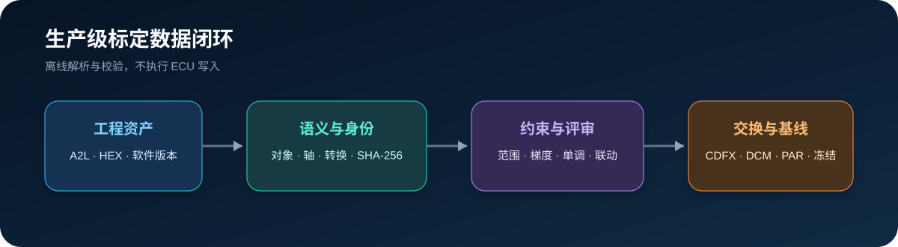

# 生产级标定数据



Agent2Canape 3.1 将 A2L、HEX、标定数据集和版本仓库连接为可验证的离线数据闭环。
本页所述接口只读写本地文件，不连接 CANape，也不会向 ECU 写入数据。

## A2L 语义目录

`A2LCatalog` 解析项目、模块、字节序、`COMPU_METHOD`、数值/文本/范围转换表、
`RECORD_LAYOUT`、`MEASUREMENT`、`CHARACTERISTIC`、`AXIS_PTS`、`BLOB`、
`AXIS_DESCR`、位掩码、功能/页面组和内存段。
解析结果可直接转换为统一 `SignalDefinition`。

```python
from agent2canape import A2LCatalog

catalog = A2LCatalog.parse("ThermalECU.a2l")
print(catalog.summary())
fan_map = catalog.get("FanDutyMap")
print(fan_map.address, fan_map.unit, fan_map.axis_descriptors)
print(fan_map.functions, fan_map.groups, fan_map.enum_values)
```

```powershell
agent2canape a2l-summary .\ThermalECU.a2l
agent2canape a2l-context .\ThermalECU.a2l `
  --device HVAC --group ThermalCalibration `
  --output .\build\thermal-context.json
```

`to_engineering_context()` 和 `a2l-context` 默认只输出标定对象，可按 `FUNCTION`、`GROUP`
或名称筛选；增加 `--include-measurements` 后同时输出测量量。生成结果带 A2L 文件
SHA-256，可作为 AI 上下文模型版本，避免工程师手工复制对象名、范围和枚举表。
MCP 的 `a2l_context` 工具默认最多返回 500 个对象，调用方应优先使用功能组或查询条件
缩小范围，避免把整份大型 A2L 注入模型上下文。

当前实现面向工程目录、身份校验和常用标定对象语义，不宣称覆盖 ASAP2 的全部可选关键字。
企业扩展关键字应在项目验收样本中单独验证。

## CDFX、DCM 与 PAR

统一入口根据文件扩展名自动选择适配器：

```python
from agent2canape import CalibrationDataset

dataset = CalibrationDataset.load("release.cdfx")
dataset.require_valid()
dataset.save("review.dcm")
dataset.save("automation.par")
```

```powershell
agent2canape calibration-convert .\release.cdfx .\review.dcm
```

| 格式 | 支持内容 | 互操作边界 |
|---|---|---|
| CDFX | 标量、曲线、MAP、ASCII、X/Y 轴、单位、身份字段 | 使用命名空间无关读取；企业模板扩展需样本验收 |
| DCM | `FESTWERT`、`KENNLINIE`、`KENNFELD`、`TEXTSTRING` | 保持确定性文本输出；供应商私有段需适配 |
| PAR | 标量、数组、二维数组、ASCII、轴和单位元数据 | Agent2Canape 确定性文本 PAR；供应商方言需适配 |

## A2L、HEX 与版本身份

```python
from agent2canape import CalibrationIdentity

identity = CalibrationIdentity.from_assets(
    vehicle="P301",
    ecu="VCU",
    software="SW_42",
    calibration="CAL_7",
    a2l="VCU.a2l",
    hex_file="VCU.hex",
)
bound = identity.bind(dataset)
result = CalibrationIdentity.verify(bound, a2l="VCU.a2l", hex_file="VCU.hex")
assert result["passed"]
```

CLI 可同时校验文件哈希和期望的软件/车辆字段：

```powershell
agent2canape calibration-verify .\release.cdfx `
  --a2l .\VCU.a2l --hex .\VCU.hex `
  --expected '{"software":"SW_42","vehicle":"P301"}'
```

## 联动约束

`CalibrationConstraintSet` 在变更计划预览阶段校验最终候选数据集，支持：

- 参数范围；
- 递增或递减约束；
- 相邻值最大梯度；
- 两个标量之间带系数、偏置和容差的关系。

```python
from agent2canape import (
    CalibrationConstraintSet,
    ParameterConstraint,
    RelationConstraint,
)

constraints = CalibrationConstraintSet(
    parameters=[
        ParameterConstraint(
            "FanCurve",
            minimum=0,
            maximum=100,
            monotonic="increasing",
            maximum_gradient=20,
        )
    ],
    relations=[
        RelationConstraint("FanOnTemp", ">=", "FanOffTemp", offset=3)
    ],
)
constraints.require_valid(dataset)
```

## 并发版本仓库与冻结基线

`CalibrationRepository` 使用跨进程文件锁保护数据文件和清单的原子提交。冻结动作要求记录
操作者和原因，`verify_all()` 会逐版本校验 SHA-256 并报告未登记文件。

```python
from agent2canape import CalibrationRepository

repository = CalibrationRepository("./calibration-repository")
repository.save(dataset, "P301_SW42_CAL7", tags=["vehicle-release"])
repository.freeze(
    "P301_SW42_CAL7",
    actor="calibration-engineer",
    reason="vehicle release baseline",
)
assert repository.verify_all()["passed"]
```

冻结是版本治理状态，不替代制品签名、可信时间戳或企业权限系统。
