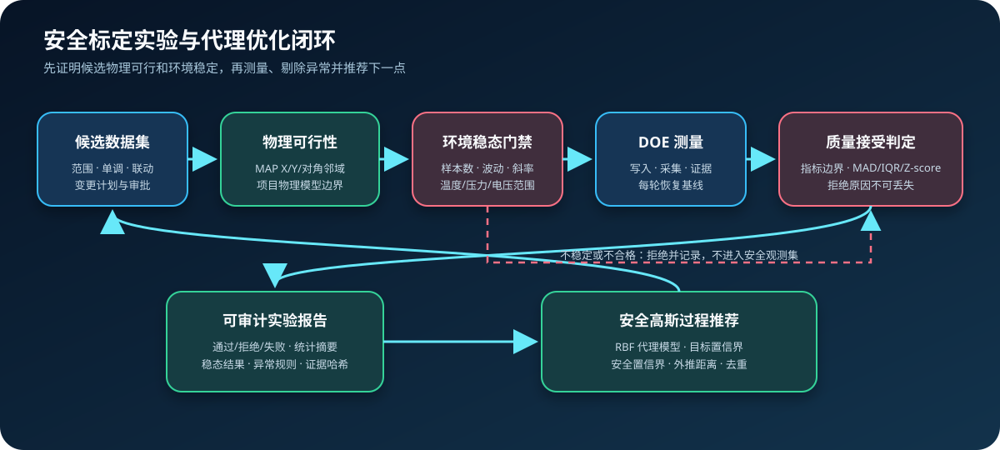

# 物理约束、DOE 质量门禁与安全代理优化



Agent2Canape 3.4 补齐“生成候选—证明可行—确认稳态—执行实验—接受或拒绝样本—
形成报告—推荐下一点”的标定决策闭环。该层适用于热管理、动力、三电、底盘、
车身和 ADAS 等专业，不绑定具体车型信号。

## 二维 MAP 邻域约束

一维扁平梯度无法区分 MAP 的 X、Y 和对角方向。
`MapNeighborhoodConstraint` 按实际轴间距检查：

- X 方向物理梯度；
- Y 方向物理梯度；
- 每个网格单元的两条对角变化；
- MAP 类型、矩阵形状、轴长度和严格递增。

```python
constraints = CalibrationConstraintSet(
    additional=[
        MapNeighborhoodConstraint(
            "TorqueMap",
            maximum_x_gradient=0.02,
            maximum_y_gradient=10.0,
            maximum_diagonal_delta=15.0,
        )
    ]
)
```

约束通过 `CalibrationConstraintSet.additional` 接入既有变更计划，因此候选值在
`CalibrationPlan.preview()` 和 `apply()` 之前就会被检查。

## 项目物理模型约束

`PhysicalModelConstraint` 接收项目提供的纯函数，将数据集转换为派生物理指标，再检查
上下界。例如可以计算：

- 冷却流量裕度、换热能力或制冷剂高压；
- 电池电流、SOC 功率裕度或热平衡；
- 扭矩储备、轮端力或排温风险；
- 制动压力、横摆率裕度或执行器能力。

物理模型返回非有限值、缺少输入或缺少规定输出时，约束直接失败。核心包不内置某一
车型公式；公式、参数和单位必须由项目适配包提供并版本化。

## 环境稳态门禁

`SteadyStateRule` 对每个实验 Case 写入前的窗口进行检查：

| 检查 | 目的 |
|---|---|
| 最小有效样本数 | 避免用瞬时点冒充稳态 |
| 窗口波动范围 | 限制峰峰值 |
| 线性斜率 | 限制持续升温、降温或压力漂移 |
| 最小/最大值 | 保证环境处于允许工况 |
| 严格递增时间轴 | 拒绝乱序、重复或无效时间戳 |

如果策略包含稳态规则，`CalibrationExperimentRunner` 强制要求
`stability_probe`。门禁失败的 Case 标记为 `rejected`，不会写入候选参数。

## 指标验收和异常剔除

`MetricAcceptanceRule` 对单个 Case 的输出指标执行上下界验收。
`OutlierRule` 在完成一批 Case 后支持：

- MAD 稳健异常分数；
- Z-score；
- IQR 围栏。

异常规则具有最小样本要求。样本不足、MAD 为零或标准差为零时不会强行剔除，而是记录
“规则未应用”的原因。被拒绝 Case 的指标、参数、规则详情和拒绝原因会持久化到实验
存储，不会混入代理模型的安全观测。

## 实验报告

```powershell
agent2canape calibration-experiment-report .\experiment.json `
  --output .\experiment-report.md
```

JSON/Markdown 报告包含：

- ECU、车辆/软件身份和实验时间；
- Case 状态统计；
- 接受样本的最小值、最大值、均值、中位数和样本标准差；
- 稳态、指标验收和异常剔除详情；
- 被拒绝和失败 Case 的明确原因；
- 每个接受 Case 的参数、指标、尝试次数和证据哈希。

## 安全高斯过程候选推荐

`SafeBayesianCalibrationOptimizer` 使用纯 Python 高斯过程：

- 参数按工程边界归一化；
- RBF 核和 Cholesky 分解；
- 每个目标/安全指标独立拟合均值和标准差；
- 最小化使用目标下置信界，最大化使用目标上置信界；
- 安全指标必须满足配置置信倍数下的完整上下界；
- 候选必须位于已验证安全观测的最大外推距离内；
- 已经执行过的候选自动排除。

```powershell
agent2canape calibration-safe-suggest .\safe-optimization.json
```

代理模型只负责推荐，绝不自动写 ECU。工程师仍需检查候选差异、物理约束、身份、
审批和恢复方案，再由受控工作流执行。

模型适合中小规模离散候选集和在线序贯标定，不替代高维专业优化平台。历史观测少于
两个、没有安全锚点、核矩阵无效或所有候选违反安全置信界时，推荐明确失败。

可运行示例见
[`examples/calibration_design.py`](../examples/calibration_design.py)。
