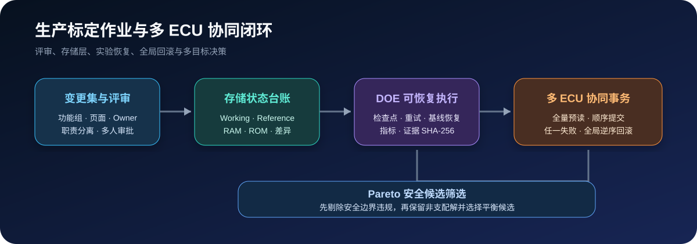

# 生产标定作业与多 ECU 协同



Agent2Canape 3.2 在标定数据底座之上增加作业治理层，覆盖变更评审、存储状态、DOE 恢复、
多 ECU 协同事务和多目标决策。所有硬件写入仍由显式调用和安全策略控制。

## 功能组、页面和责任人变更集

每个变更项记录功能组、页面、责任人、风险、原因、期望基线和证据。变更集 owner 不能
审批自己的变更，可配置一个或多个独立审批人。

```python
from agent2canape import (
    CalibrationChangeItem,
    CalibrationChangeSet,
    ReviewDecision,
)

change_set = CalibrationChangeSet(
    name="P301-thermal-release-42",
    owner="calibrator",
    ticket="CAL-42",
    required_approvals=2,
    items=[
        CalibrationChangeItem(
            name="FanOnTemp",
            value=94.0,
            expected_before=96.0,
            enforce_expected=True,
            reason="降低高负荷冷却液温度峰值",
            function_group="thermal-control",
            page="fan-control",
            owner="thermal-calibrator",
            risk="high",
            evidence=("baseline.mf4",),
        )
    ],
)
change_set.submit(baseline)
change_set.review("software-owner", ReviewDecision.APPROVE)
change_set.review("vehicle-owner", ReviewDecision.APPROVE)
plan = change_set.build_plan()
```

CLI 可输出按功能、页面、责任人和风险聚合的评审摘要：

```powershell
agent2canape calibration-review .\change-set.json --dataset .\baseline.cdfx
```

## Working、Reference、RAM 与 ROM

`CalibrationMemoryLedger` 只记录调用方实际获取或确认过的快照，不会把“计划下载”误报为
“已经写入 ECU”。

```python
from agent2canape import CalibrationMemoryLedger

ledger = CalibrationMemoryLedger("VCU")
ledger.record("reference", reference, actor="engineer", verified=True)
ledger.record("working", working, actor="engineer")
ledger.record("ram", ram_upload, actor="CANape", verified=True)

download_plan = ledger.transition_plan("working", "ram")
print(download_plan["differences"])
```

只有 working、RAM、ROM 三层摘要一致时，`require_persistent()` 才会通过：

```powershell
agent2canape calibration-memory-status .\memory-ledger.json
```

该状态模型提供证据和门禁；实际 RAM 下载、ROM 持久化仍必须由车型对应的 CANape/ECU
接口执行并回读确认。

## DOE 断点续跑与证据

`CalibrationExperimentStore` 在每个 case 前后原子保存检查点。运行中断的 case 可恢复为
`pending`，失败 case 可按策略重试；每轮都会恢复原始基线。跨进程运行锁会阻止两个
执行器同时控制同一实验；异常遗留锁只能通过记录操作者和原因的 `recover_run_lock()` 恢复。

```python
from agent2canape import CalibrationExperimentRunner, CalibrationExperimentStore

store = CalibrationExperimentStore.create(
    "warmup-doe.json",
    name="warmup-doe",
    device="VCU",
    cases=cases,
    identity={"vehicle": "P301", "software": "SW_42"},
)

result = CalibrationExperimentRunner.run(
    canape,
    store,
    evaluator=evaluate_case,
    evidence_collector=collect_mf4_and_report,
    retry_failed=True,
)
```

每个证据文件记录绝对路径、大小和 SHA-256；文件丢失或被修改会在状态汇总中报告：

```powershell
agent2canape calibration-experiment-status .\warmup-doe.json
```

## 多 ECU 协同事务

协调器在任何写入前读取所有 ECU 的目标标定量并检查全部计划审批。任一设备写入失败时，
已尝试对象按全局逆序恢复；若回滚本身失败，会升级为 `SafetyViolationError` 并明确列出
未恢复对象。

```python
from agent2canape import ECUCalibrationTask, MultiECUCalibrationCoordinator

result = MultiECUCalibrationCoordinator.apply(
    canape,
    [
        ECUCalibrationTask("VCU", vcu_plan),
        ECUCalibrationTask("BMS", bms_plan),
        ECUCalibrationTask("TMM", tmm_plan),
    ],
)
```

跨 ECU 事务不能提供数据库级原子性。项目仍应配置供电、通信、点火、急停和掉线恢复策略。

## Pareto 安全候选

多目标分析先应用安全边界，再计算非支配候选。这样不会因为舒适性或能耗指标更优而把越过
安全温度、电流、压力或扭矩边界的候选带入 Pareto 前沿。

```python
from agent2canape import (
    CalibrationCandidate,
    CalibrationObjective,
    ParetoCalibrationAnalysis,
)

analysis = ParetoCalibrationAnalysis.analyze(
    candidates,
    [
        CalibrationObjective("comfort_error", "minimize"),
        CalibrationObjective("energy_kwh", "minimize"),
    ],
    safety_limits={
        "compressor_discharge_temp": (None, 135.0),
        "battery_current": (-300.0, 300.0),
    },
)
```

`select_balanced()` 在 Pareto 前沿上按归一化理想点距离选择平衡候选。它是工程决策辅助，
不是自动批准；最终候选仍应进入变更集评审和实车/台架验证。
