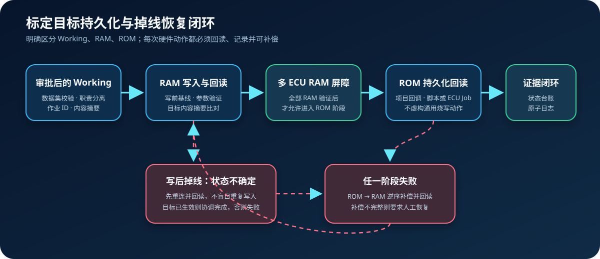

# 标定目标适配、持久化与掉线恢复



Agent2Canape 3.3 将 v3.2 的 Working/Reference/RAM/ROM 状态台账接入可执行的
目标适配协议。通用层负责审批约束、原子作业日志、写前基线、回读验证、掉线协调、
跨进程占用锁和失败补偿；车型层只需要实现目标 ECU 的具体动作。

## 为什么需要目标适配层

不同 ECU 对“保存到 ROM”的定义并不相同，可能是 CANape 页面命令、CNS 脚本、
XCP Page Switching、厂商 Job、诊断例程或重新下载数据集。通用包不能把某一种
操作假定为所有 ECU 的真实持久化动作。

`CalibrationTargetAdapter` 因此明确要求六组能力：

| 能力 | 工程含义 |
|---|---|
| `capture` | 从 RAM 或 ROM 捕获指定对象，并返回可校验数据集 |
| `apply_ram` | 将 Working 数据集应用到 RAM |
| `persist_rom` | 执行项目定义的 RAM→ROM 动作 |
| `restore_ram` | 失败时恢复 RAM 基线 |
| `restore_rom` | 失败时恢复 ROM 基线 |
| `is_online` / `reconnect` | 判断掉线并恢复通信与测量状态 |

`CANapeCalibrationTarget` 已直接实现通用 RAM 读写。ROM 动作必须通过
`rom_reader`、`rom_persist` 和 `rom_restore` 注入，缺少回调时会明确抛出
`NotImplementedError`，不会将“计划持久化”报告成“ROM 已写入”。

## 单 ECU 持久化作业

```python
from agent2canape import (
    CalibrationMemoryLedger,
    CalibrationPersistenceCoordinator,
    CANapeCalibrationTarget,
)

target = CANapeCalibrationTarget(
    canape,
    rom_reader=project_rom_reader,
    rom_persist=project_rom_persist,
    rom_restore=project_rom_restore,
)
coordinator = CalibrationPersistenceCoordinator(
    target,
    CalibrationMemoryLedger("VCU"),
    journal_path="evidence/VCU-CAL-42.json",
)
result = coordinator.execute(
    working_dataset,
    job_id="CAL-42",
    actor="calibrator",
    approved_by="vehicle-reviewer",
    persist_rom=True,
)
```

执行人与审批人必须分离。作业日志绑定 `job_id` 和 Working 内容摘要；同一作业成功后
重复调用会返回幂等结果，参数或数据集变化则被拒绝。

## 写后掉线的安全协调

硬件调用可能已经修改 ECU，但响应在链路中断时丢失。此时不能直接重试：

1. 判断设备是否掉线；
2. 按受限次数重连，并恢复原测量运行态；
3. 重新捕获目标层；
4. 若内容已经等于 Working，记录 `mutation_reconciled` 并继续；
5. 若不一致，执行基线补偿并将原异常返回；
6. 补偿失败则将作业置为 `recovery_required`，列出人工恢复项。

跨进程 `.lock` 防止两个 AI Agent 或两个终端同时控制同一持久化作业。异常退出留下的
锁只能在确认原进程已经消失后，通过带操作者和原因的 `recover_stale_lock()` 恢复。

## 多 ECU 分阶段提交

`StagedMultiECUPersistenceCoordinator` 使用两阶段屏障：

1. 捕获所有 ECU 的 RAM/ROM 基线；
2. 依次应用 RAM，但每个 ECU 都必须回读成功；
3. 只有全部 RAM 验证完成，才开始 ROM 阶段；
4. 任一阶段失败，按 ROM→RAM、设备逆序执行补偿；
5. 任一补偿失败，升级为 `SafetyViolationError` 并列出未恢复层。

跨 ECU 操作不是数据库原子事务。即使提供了补偿，项目仍应在台架上验证断电、总线拥塞、
Boot 状态、部分 ECU 重启和 ROM 恢复能力。

## 故障注入验收

`InMemoryCalibrationTarget` 用于 CI 和台架脚本开发，可确定性注入：

- RAM 写前失败；
- RAM 已写入但响应前掉线；
- ROM 持久化前失败；
- ROM 已修改但响应前掉线；
- 重连失败；
- RAM 或 ROM 补偿失败。

可运行示例见
[`examples/calibration_persistence.py`](../examples/calibration_persistence.py)。

## 状态查询

```powershell
agent2canape calibration-persistence-status .\evidence\VCU-CAL-42.json
```

AI/MCP 只读工具 `calibration_persistence_status` 支持“查看持久化作业”等自然语言请求。
真实 RAM/ROM 动作仍必须通过 Python 项目适配器或受审批的工作流显式调用。
