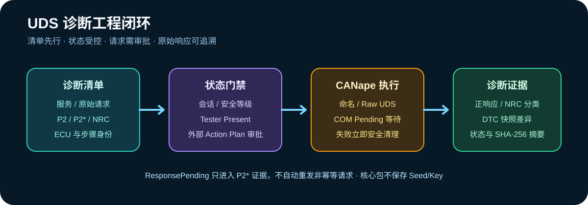

# UDS 诊断工程

Agent2Canape 3.11 在 CANape 原始/命名诊断请求之上增加受控诊断清单、状态门禁、NRC
解释和 DTC 证据，适用于问题排查、标定前置确认及刷写前后验收。



## 安全边界

- `diagnostic-plan` 和 `diagnostic-dtc-decode` 完全离线，不访问 CANape 或 ECU。
- `diagnostic_sequence_execute` 属于 `DIAGNOSTIC` 风险，必须通过外部 Action Plan 审批。
- 清单不会保存 Seed/Key、证书或密钥；安全算法必须由项目外部提供器实现。
- 本模块不把 NRC `0x78 ResponsePending` 当成重新发送许可。CANape 请求对象负责等待，
  Agent2Canape 只记录 P2* 语义，避免重复执行 Routine、写 DID 或下载类请求。
- 会话和安全等级是清单声明并由成功步骤推进的运行状态，不伪装成 ECU 隐式实测状态。

## 清单规划

参考 [`examples/diagnostic_sequence.yaml`](../examples/diagnostic_sequence.yaml)：

```powershell
agent2canape diagnostic-plan examples\diagnostic_sequence.yaml
```

每个步骤必须且只能选择一种请求方式：

- `payload`：原始 UDS 字节；
- `service` 与 `parameters`：CANape 诊断数据库中的命名服务。

步骤还可声明 `required_session`、`required_security_level`、成功后的状态迁移、允许的 NRC、
Tester Present 和独立 P2/P2* 超时。状态不满足时，请求不会发送。

## NRC 解释

`interpret_nrc()` 返回名称、工程分类、是否允许有限重试以及处置建议。分类覆盖请求错误、
能力不支持、状态顺序、安全访问、临时忙、网络、编程、传输、电源和车辆状态。

以下情况不会被自动重试：

- `0x35 invalidKey`、`0x36 exceedNumberOfAttempts`；
- 编程失败、条件不满足或请求顺序错误；
- 未经项目明确判定为幂等的任何请求。

## DTC 快照

离线解析标准 `0x59` 正响应：

```powershell
agent2canape diagnostic-dtc-decode `
  0x59 0x02 0xFF 0x12 0x34 0x56 0x09 --source pre-calibration
```

`DTCSnapshot.diff()` 给出新增、消失和状态变化的故障码。快照摘要排除采集时间，但保留来源、
子功能、状态可用掩码、原始 DTC 和状态字节，便于刷写或标定前后比较。

## Python API

```python
from agent2canape import DiagnosticManifest, DiagnosticSequenceRunner

manifest = DiagnosticManifest.load("examples/diagnostic_sequence.yaml")
manifest.require_valid()
report = DiagnosticSequenceRunner(canape).execute(manifest)
if not report["passed"]:
    raise RuntimeError("诊断门禁失败：" + "; ".join(report["errors"]))
```

直接调用 Runner 不会替代组织审批。面向 AI 的执行应始终通过
`diagnostic_sequence_execute`，由 Agent2Canape 的摘要绑定和单次审批机制控制。

## 工程验收建议

1. 每个 ECU 软件基线维护独立 DID、Routine、会话和允许 NRC 清单。
2. 在标定写入前读取 VIN、软件指纹、标定指纹、供电与车辆安全状态。
3. 在刷写前后保存 DTC、软件指纹、标定身份和拓扑快照并生成差异。
4. 在真实台架验证 P2/P2*、网关路由、功能/物理寻址和 Tester Present 周期。
5. 对断电、总线拥塞、ECU Reset、`0x78`、`0x36` 和错误会话执行故障注入验收。
