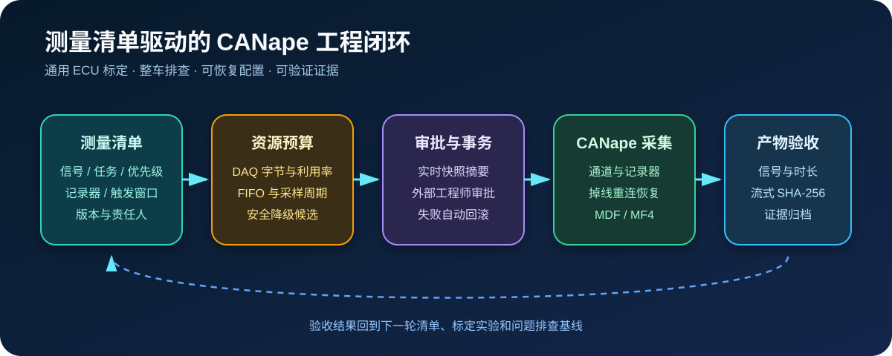

# 测量工程闭环

`Agent2Canape` 3.8 将“启动测量”扩展为可评审、可恢复、可验收的工程作业。清单同时描述
信号、任务容量、FIFO、记录器、触发窗口和录制文件，既适用于热管理，也适用于动力、
底盘、车身、三电和 ADAS 标定或问题排查。



## 清单和 DAQ 预算

参考 [`examples/measurement_manifest.yaml`](../examples/measurement_manifest.yaml)。每个信号需
明确设备、任务、采样字节、可选采样率、是否必需和优先级；每个任务需声明周期、通道上限、
字节预算、利用率阈值和最小 FIFO。

```powershell
agent2canape measurement-plan examples\measurement_manifest.yaml
```

规划器会拒绝重复信号、缺失任务预算、超任务采样率、无效优先级、DAQ 超载、FIFO 不足、
记录器引用错误和非 MDF/MF4 输出。若超载，它只给出非必需信号的安全降级候选，不会自动
删除任何工程信号。

## 事务应用和恢复

Python API 使用 `MeasurementSessionManager`：

```python
from agent2canape import CANape, MeasurementManifest, MeasurementSessionManager

manifest = MeasurementManifest.load("examples/measurement_manifest.yaml")
with CANape() as canape:
    canape.open(r"D:\VehicleProject")
    manager = MeasurementSessionManager(canape)
    preview = manager.preview(manifest)
    result = manager.apply(manifest)
```

应用前会快照测量运行态、全局测量配置、输出文件、任务通道和记录器。任一步失败都会恢复
快照；`reconnect_and_restore()` 会在设备重连后重建清单并恢复重连前的运行状态。

AI/MCP 中的 `measurement_apply` 和 `measurement_reconnect_restore` 属于
`MEASUREMENT_CONTROL`，必须先生成 Action Plan，再由工程师在 MCP 外审批。审批绑定实时
快照摘要；CANape 状态在审批期间发生变化时，旧计划会被拒绝。

## 触发器能力边界

本机核验的 CANape 1.9 COM Type Library 暴露测量、任务、通道和记录器接口，但没有通用的
触发器配置接口。因此：

- 清单会校验触发表达式、记录器引用、前后触发时间和 FIFO 预算；
- 触发表达式需在受控 CNA 或项目脚本中预配置；
- 核心库不会猜测或伪造 COM 触发方法；
- 项目集成时应让清单中的触发器名称与 CNA/脚本中的名称保持一致并纳入版本基线。

## 录制产物验收

基础模式校验路径、扩展名、最小大小和流式 SHA-256；深度模式使用 `asammdf` 校验期望信号
与最短录制时长：

```powershell
agent2canape measurement-verify build\vehicle-measurement.mf4 `
  --minimum-bytes 1048576 `
  --expected-channel VehicleSpeed `
  --expected-channel EngineSpeed `
  --minimum-duration-seconds 60 `
  --deep
```

对应只读 MCP 工具是 `measurement_plan` 和 `measurement_artifact_verify`。建议把返回的
清单摘要、文件 SHA-256、通道数和时长写入问题单、标定实验或发布证据包。

## 工程门禁建议

1. 清单、A2L、CNA 和软件版本必须来自同一受控基线。
2. DAQ 利用率阈值应由实际 XCP/总线/ECU 资源试验标定，示例值不能直接替代项目限值。
3. 设备重连只恢复测量配置，不等于标定 RAM/ROM 或诊断会话已恢复。
4. 上车前先在离线或台架环境执行清单规划、短时录制和深度产物验收。
5. ECU 写入、诊断和刷写仍需独立的安全审批与硬件验收。
