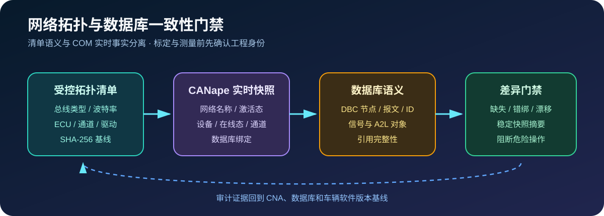

# 网络拓扑与数据库一致性审计

`Agent2Canape` 3.10 在标定、测量、诊断或刷写前建立网络—设备—通道—数据库门禁，防止
工程虽然能打开，却使用了错误通道、驱动、在线状态、A2L/DBC 或网络激活配置。



## COM 能力边界

本机 CANape 1.9 Type Library 核验结果：

- `INetWork` 只可靠提供 `Name`、`IsActivate` 和 `Activate`；
- `IDevice/IDevice2` 提供名称、驱动、通道、在线态、主数据库和数据库集合；
- `IDevice2.NetWork` 在支持的驱动上可返回设备所属网络；旧接口或部分驱动可能不可用；
- COM 不提供统一的 CAN/LIN/FlexRay/Ethernet 总线类型和波特率读取接口。

因此，总线类型、仲裁/数据波特率属于受控拓扑清单；实时审计只比较 COM 实际可见字段，
不会把清单值伪装成 CANape 实测值。

## 拓扑清单

参考 [`examples/network_topology.yaml`](../examples/network_topology.yaml)：

```powershell
agent2canape network-topology-plan examples\network_topology.yaml --deep
```

清单可描述：

- CAN、CAN FD、LIN、FlexRay、Ethernet 或其他网络；
- 网络期望激活态、波特率及是否必需；
- ECU 名称、网络、通道、驱动、在线态和数据库绑定；
- DBC/A2L/ODX/ARXML/LDF 等数据库资产路径、SHA-256 和是否必需；
- DBC 期望节点、报文、帧 ID 和信号；
- A2L 期望对象及目录引用完整性。

相对数据库路径以拓扑清单所在目录为基准。生产基线应填写 SHA-256；文件变化后，清单必须
经过评审更新，不能自动接受新哈希。

DBC/A2L 深度语义解析在 30 秒受控隔离子进程中运行；解析器异常、无响应、非 UTF-8 输出
或非零退出都会转化为明确审计错误，不会无限占用 MCP 工作线程。

## 实时 CANape 审计

```powershell
agent2canape network-topology-audit D:\VehicleProject `
  examples\network_topology.yaml --deep `
  --snapshot-output build\network-topology-snapshot.json
```

审计报告包含清单与实时快照摘要、资产哈希和语义、所有差异、错误与警告。典型阻断项包括：

- 必需网络或设备缺失；
- 网络激活态、设备通道、驱动、在线态或网络绑定不一致；
- ECU 未加载清单要求的数据库；
- 不允许的清单外网络或设备；
- 数据库缺失、SHA-256 漂移、DBC 节点/报文/帧 ID/信号缺失；
- A2L 引用不完整或关键对象缺失。

`NetworkTopologySnapshot.digest()` 排除采集时间，因此相同工程状态具有稳定摘要；
`CANapeTopologyAuditor.diff()` 可比较两个快照中的网络和设备变化。

## Python API

```python
from agent2canape import CANapeTopologyAuditor, NetworkTopologyManifest

manifest = NetworkTopologyManifest.load("examples/network_topology.yaml")
auditor = CANapeTopologyAuditor(canape)
report = auditor.audit(manifest, deep=True)
if not report["passed"]:
    raise RuntimeError("拓扑门禁失败：" + "; ".join(report["errors"]))
```

## AI/MCP

| 工具 | 风险 | 用途 |
|---|---|---|
| `network_topology_plan` | `READ_ONLY` | 离线校验引用、资产和可选数据库语义 |
| `network_topology_audit` | `READ_ONLY` | 捕获 CANape 实际拓扑并生成差异报告 |

实时审计进入共享 `canape-com` 资源租约，避免多个 Codex/Claude Code 会话同时占用非线程安全
COM 会话。审计本身不激活网络、不修改设备在线态、不加载数据库，也不执行 ECU 写入。

## 项目验收建议

1. 为每个 CNA/车型/软件基线保存独立拓扑清单和数据库哈希。
2. 在测量清单应用、标定写入、诊断和刷写之前先执行拓扑门禁。
3. 对总线类型和波特率使用 Vector 硬件配置或项目工具补充验证，不能仅依赖 COM。
4. DBC/A2L 深度审计证明文件语义满足清单，不证明 ECU 实际发送/接收行为正确。
5. 实车或台架还需验证物理通道、终端电阻、总线负载、时间同步和故障恢复。
