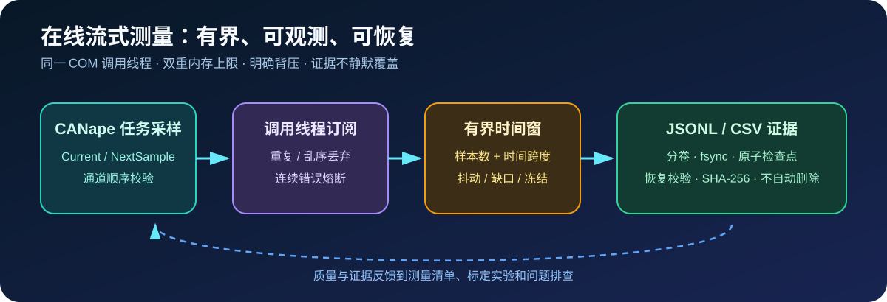

# 在线流式测量

`Agent2Canape` 3.9 在测量清单和录制文件闭环之上增加任务级在线订阅，用于标定观察窗、
短时问题捕获和长时间质量监控。实现采用调用线程同步读取 CANape COM，不把 COM 对象传入
后台线程，避免 Windows COM Apartment 不一致。



## 订阅规格

参考 [`examples/measurement_subscription.yaml`](../examples/measurement_subscription.yaml)：

```powershell
agent2canape measurement-stream-plan examples\measurement_subscription.yaml
```

规格必须明确设备、任务、通道、读取模式、CANape 时间戳到秒的比例、期望周期、样本数上限、
时间跨度上限、轮询间隔和连续错误上限。内存同时受 `buffer_samples` 与
`max_age_seconds` 约束，不会随采集时长无限增长。

`mode: next` 消费任务 FIFO 的下一采样，适合连续采集；`mode: current` 读取当前值，适合
低频观察。重复时间戳和乱序样本会被明确丢弃并计入状态，不能用 `current` 模式的紧循环
伪造更高采样率。

## Python API

```python
from agent2canape import (
    MeasurementStreamSubscription,
    MeasurementSubscriptionSpec,
    RotatingMeasurementWriter,
)

spec = MeasurementSubscriptionSpec.load("examples/measurement_subscription.yaml")
with RotatingMeasurementWriter(
    "build/vehicle-stream.jsonl",
    spec.channels,
    max_part_bytes=64 * 1024 * 1024,
) as writer:
    subscription = MeasurementStreamSubscription(canape, spec, writer=writer)
    result = subscription.collect(10_000)
```

调用方负责在创建订阅前完成 CANape 工程、通道和测量状态配置。同一订阅对象必须在创建它的
线程中轮询；需要后台运行时，应由项目创建专属 CANape/COM 工作线程，并把普通 Python 数据
传给其他线程，不能共享 COM 对象。

## 滚动质量统计

`BoundedMeasurementBuffer.report()` 返回：

- 保留、接收、容量淘汰和时间淘汰样本数；
- 重复与乱序丢弃数；
- 平均周期、最大采样断点、P95/最大抖动和估算缺失样本；
- 每个通道的缺失、非数值、最小/最大/均值、标准差、RMS、变化次数和最长冻结时间。

统计结果用于在线观察和门禁线索，不替代 MDF 的最终证据。关键标定结论仍应保留受控
MDF/MF4，并使用 `measurement-verify --deep` 验收。

## 增量证据与恢复

`RotatingMeasurementWriter` 支持 JSONL/CSV：

- 按字节数分卷，避免单文件无限增长；
- 每次刷新后 `fsync`，并原子更新 `.state.json` 检查点；
- 恢复时校验输出路径、通道、分卷编号和精确字节数；
- 检查点与文件不一致时拒绝自动截断或覆盖；
- 达到最大分卷数时停止并报错，不删除历史证据；
- 关闭时为每个分卷生成 SHA-256。

## AI/MCP

| 工具 | 风险 | 用途 |
|---|---|---|
| `measurement_stream_plan` | `READ_ONLY` | 校验规格和内存预算 |
| `measurement_stream_snapshot` | `READ_ONLY` | 最多读取 1000 个样本并返回窗口统计 |
| `measurement_stream_collect` | `PROJECT_CONTROL` | 最多采集 100000 个样本并写入分卷证据 |

写文件的流式采集必须先生成 Action Plan。计划绑定测量运行态、全局测量配置和任务通道
清单；审批期间状态变化会使计划失效。MCP 的样本上限用于避免长时间占用 stdio 调用，持续
数小时的任务应使用 Python API 或项目工作流，并配置独立生命周期和取消策略。
